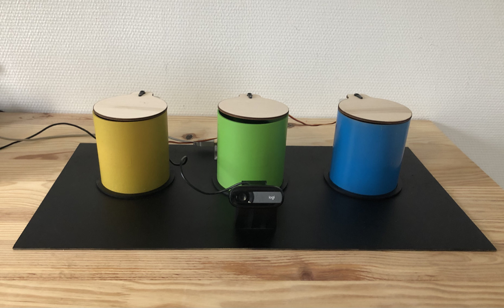

# ML Trash Selector 

The goal of this project is to throw waste into the right trash.

To do so you need to connect a webcam to your computer and and arduino uno with 3 servomotors connected.



The model has been created with TeachableMachine : https://teachablemachine.withgoogle.com

IMPORTANT : The code can only be run with Python 3.8.1

## Run script 

* Create virtual env : https://docs.python.org/3/library/venv.html

Activate virtual environment

* Window 

In the PowerShell enter :

```
myenv\Scripts\activate.bat
```

* Unix/MacOS

```shell
source myenv/bin/activate
```

Then, you can run the script by entering the following command :
```shell
(myenv) computerName:ML_trash_selector$ python3 main.py
```

### Install libraries 

Libraries have to be installed in the virtual env.

The following command permits to install all the libraries needed to run the code :

```
    activate venv (see above)
    pip install numpy
    pip install pillow
    pip install opencv-python
    pip install tensorflow
    pip install serial

    run main script
```

## Update Model 

If you want to update the model you have to create new classes in TeachableMachine and then train the model and export the model using TensorFlow and Keras.

Then you have to replace keras_model.h5 with the downloaded one.


## Arduino connection

If you've got error concerning serial communication, check the port com defined in main.py line 13.

```python
arduino = serial.Serial(port="/dev/tty.usbmodem143101", baudrate=9600) # create usb link
```

On window it might by on port COM.

Do not hesitate to add issues if you've got any errors.